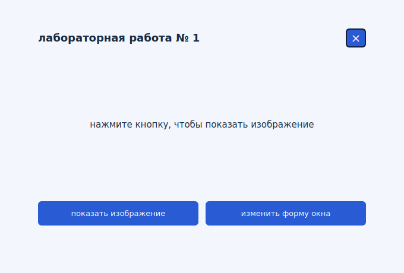
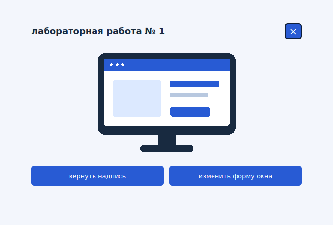
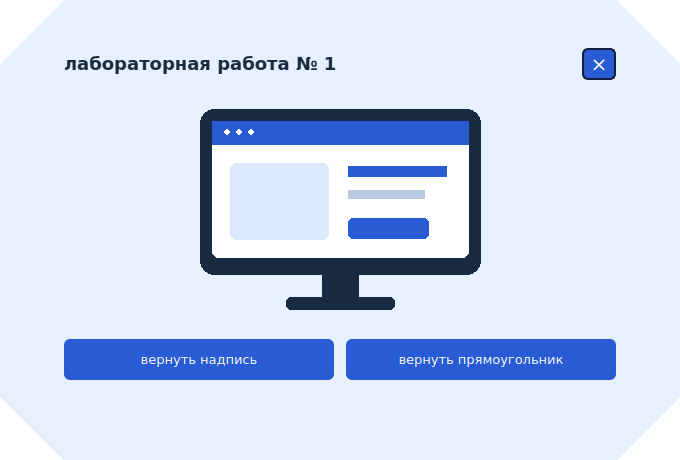

# Лабораторная работа № 1

Основы проектирования графического интерфейса компьютерных систем

## Задание

Нужно создать окно с надписью и кнопкой. После нажатия надпись должна заменяться изображением. В приложенной схеме есть ещё одна кнопка, которая меняет форму окна с помощью полупрозрачного PNG.

Программа написана на Python с PyQt5, который используется в лекциях. Интерфейс создаётся в коде без Qt Designer.

## Работа программы

После запуска появляется прямоугольное окно с надписью. Кнопка "показать изображение" заменяет её картинкой. Повторное нажатие возвращает текст.

Кнопка "изменить форму окна" применяет маску из файла `assets/window_shape.png`. Углы окна становятся срезанными, а фон полупрозрачным. Повторное нажатие возвращает прямоугольную форму.

Окно можно перемещать за фон или заголовок. Для закрытия используется крестик или клавиша Esc. Кнопки можно выбирать клавишей Tab и нажимать пробелом.

## Запуск

Из папки проекта нужно создать виртуальное окружение.

```bash
python -m venv .venv
```

В Windows установить зависимость и запустить программу можно без активации окружения.

```powershell
.\.venv\Scripts\python.exe -m pip install -r requirements.txt
.\.venv\Scripts\python.exe main.py
```

Для Linux и macOS команды отличаются путём к Python.

```bash
.venv/bin/python -m pip install -r requirements.txt
.venv/bin/python main.py
```

В PyCharm нужно выбрать интерпретатор из `.venv` и запустить `main.py`. Папка `assets` должна находиться рядом с ним.

## Реализация

Класс `LabWindow` наследуется от `QWidget`. Надпись и изображение отображаются в одном `QLabel`. Сигнал `clicked` первой кнопки связан с методом `toggle_image()`, который вызывает `setPixmap()` или `setText()`.

За форму окна отвечает метод `toggle_shape()`. Маска PNG задаёт границы окна, а его альфа-канал задаёт прозрачность фона. Метод `paintEvent()` рисует прямоугольник или загруженный PNG. Размер окна фиксирован, чтобы фон и маска совпадали.

Системная рамка отключена через `FramelessWindowHint`, поэтому перемещение и закрытие обрабатываются в программе. Атрибут `WA_TranslucentBackground` разрешает прозрачный фон.

Перед созданием `QApplication` явно задаётся путь к папке плагинов установленного PyQt5. Эта настройка исправила ошибку поиска плагина `windows` при запуске проекта.

## Проверка

Тесты находятся в `tests/test_app.py`. В Windows их можно запустить из папки проекта следующей командой.

```powershell
.\.venv\Scripts\python.exe -m unittest discover -s tests -v
```

Тесты проверяют переключение надписи и изображения, маску окна, повторные нажатия, управление с клавиатуры, закрытие и обработку отсутствующих ресурсов. Проверка выполняется в режиме `offscreen`. Для проверки прозрачности поверх рабочего стола и перемещения нужно запустить само приложение.

## Снимки интерфейса

Начальное состояние



После замены надписи



После изменения формы окна


